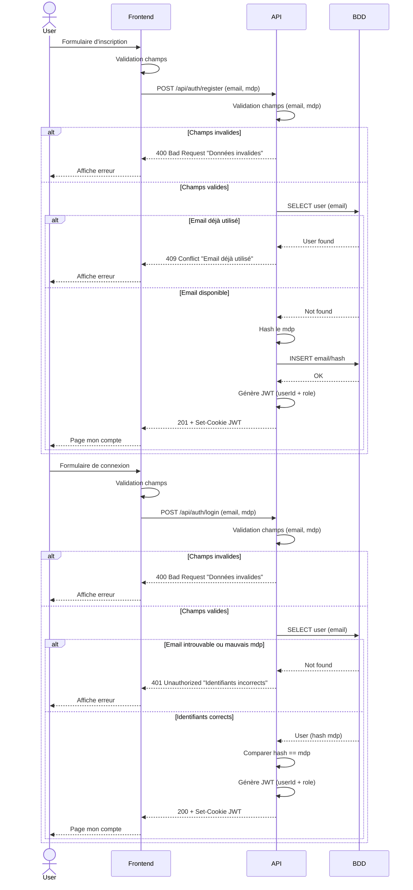

```mermaid
sequenceDiagram
    actor User
    participant Frontend
    participant API
    participant BDD

    %% Inscription
    User->>Frontend: Formulaire d'inscription
    Frontend->>Frontend: Validation champs
    Frontend->>API: POST /api/auth/register (email, mdp)
    API->>API: Validation champs (email, mdp)

    alt Champs invalides
        API-->>Frontend: 400 Bad Request "Données invalides"
        Frontend-->>User: Affiche erreur
    else Champs valides
        API->>BDD: SELECT user (email)
        alt Email déjà utilisé
            BDD-->>API: User found
            API-->>Frontend: 409 Conflict "Email déjà utilisé"
            Frontend-->>User: Affiche erreur
        else Email disponible
            BDD-->>API: Not found
            API->>API: Hash le mdp
            API->>BDD: INSERT email/hash
            BDD-->>API: OK
            API->>API: Génère JWT (userId + role)
            API-->>Frontend: 201 + Set-Cookie JWT
            Frontend-->>User: Page mon compte
        end
    end

    %% Connexion
    User->>Frontend: Formulaire de connexion
    Frontend->>Frontend: Validation champs
    Frontend->>API: POST /api/auth/login (email, mdp)
    API->>API: Validation champs (email, mdp)

    alt Champs invalides
        API-->>Frontend: 400 Bad Request "Données invalides"
        Frontend-->>User: Affiche erreur
    else Champs valides
        API->>BDD: SELECT user (email)
        alt Email introuvable ou mauvais mdp
            BDD-->>API: Not found
            API-->>Frontend: 401 Unauthorized "Identifiants incorrects"
            Frontend-->>User: Affiche erreur
        else Identifiants corrects
            BDD-->>API: User (hash mdp)
            API->>API: Comparer hash == mdp
            API->>API: Génère JWT (userId + role)
            API-->>Frontend: 200 + Set-Cookie JWT
            Frontend-->>User: Page mon compte
        end
    end
```