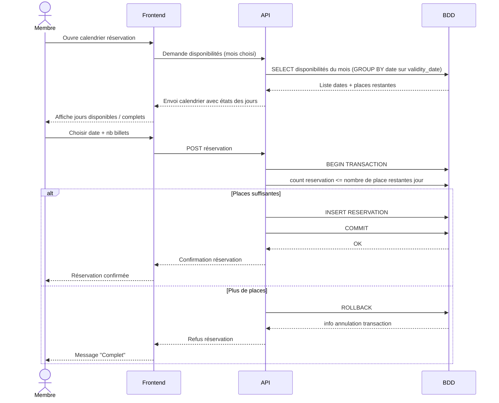

```mermaid
sequenceDiagram
    actor Membre
    participant Frontend
    participant API
    participant BDD

    Membre->>Frontend: Ouvre calendrier réservation
    Frontend->>API: Demande disponibilités (mois choisi)
    API->>BDD: SELECT disponibilités du mois (GROUP BY date sur validity_date) 
    BDD-->>API: Liste dates + places restantes
    API-->>Frontend: Envoi calendrier avec états des jours
    Frontend-->>Membre: Affiche jours disponibles / complets


    Membre->>Frontend: Choisir date + nb billets
    Frontend->>API: POST réservation
    API->>BDD: BEGIN TRANSACTION
    API->>BDD: count reservation <= nombre de place restantes jour
    alt Places suffisantes
        API->>BDD: INSERT RESERVATION
        API->>BDD: COMMIT
        BDD-->>API: OK
        API-->>Frontend: Confirmation réservation
        Frontend-->>Membre: Réservation confirmée
    else Plus de places
        API->>BDD: ROLLBACK
        BDD-->>API: info annulation transaction
        API-->>Frontend: Refus réservation
        Frontend-->>Membre: Message "Complet"
    end
```