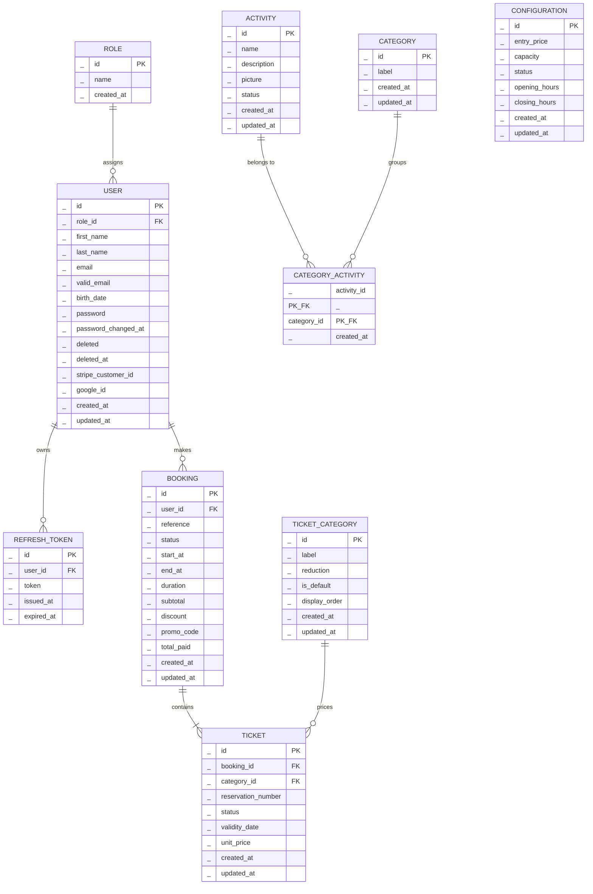

```mermaid
%%{init: {'er': {'layoutDirection': 'TB', 'entityPadding': 10, 'minEntityWidth': 120}}}%%
erDiagram
    ROLE              ||--o{ USER              : "assigns"
    USER              ||--o{ REFRESH_TOKEN     : "owns"
    USER              ||--o{ BOOKING           : "makes"
    BOOKING           ||--|{ TICKET            : "contains"
    TICKET_CATEGORY   ||--o{ TICKET            : "prices"
    ACTIVITY          ||--o{ CATEGORY_ACTIVITY : "belongs to"
    CATEGORY          ||--o{ CATEGORY_ACTIVITY : "groups"

    ROLE {
        _ id PK
        _ name
        _ created_at
    }

    USER {
        _ id PK
        _ role_id FK
        _ first_name
        _ last_name
        _ email
        _ valid_email
        _ birth_date
        _ password
        _ password_changed_at
        _ deleted
        _ deleted_at
        _ stripe_customer_id
        _ google_id
        _ created_at
        _ updated_at
    }

    REFRESH_TOKEN {
        _ id PK
        _ user_id FK
        _ token
        _ issued_at
        _ expired_at
    }

    ACTIVITY {
        _ id PK
        _ name
        _ description
        _ picture
        _ status
        _ created_at
        _ updated_at
    }

    CATEGORY {
        _ id PK
        _ label
        _ created_at
        _ updated_at
    }

    CATEGORY_ACTIVITY {
        _ activity_id PK_FK
        _ category_id PK_FK
        _ created_at
    }

    BOOKING {
        _ id PK
        _ user_id FK
        _ reference
        _ status
        _ start_at
        _ end_at
        _ duration
        _ subtotal
        _ discount
        _ promo_code
        _ total_paid
        _ created_at
        _ updated_at
    }

    TICKET {
        _ id PK
        _ booking_id FK
        _ category_id FK
        _ reservation_number
        _ status
        _ validity_date
        _ unit_price
        _ created_at
        _ updated_at
    }

    TICKET_CATEGORY {
        _ id PK
        _ label
        _ reduction
        _ is_default
        _ display_order
        _ created_at
        _ updated_at
    }

    CONFIGURATION {
        _ id PK
        _ entry_price
        _ capacity
        _ status
        _ opening_hours
        _ closing_hours
        _ created_at
        _ updated_at
    }
```
