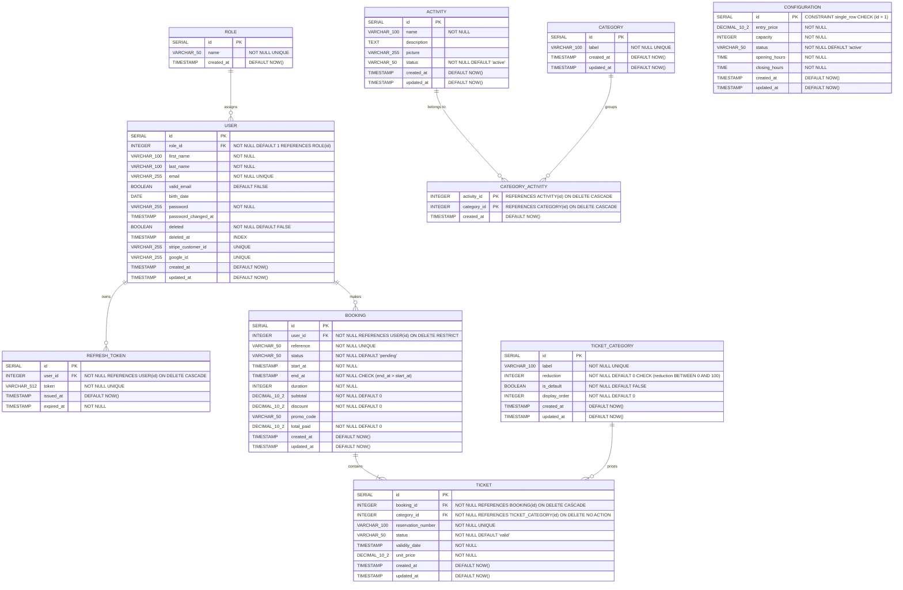

```mermaid
%%{init: {'er': {'layoutDirection': 'TB', 'entityPadding': 10, 'minEntityWidth': 120}}}%%
erDiagram
    ROLE              ||--o{ USER              : "assigns"
    USER              ||--o{ REFRESH_TOKEN     : "owns"
    USER              ||--o{ BOOKING           : "makes"
    BOOKING           ||--|{ TICKET            : "contains"
    TICKET_CATEGORY   ||--o{ TICKET            : "prices"
    ACTIVITY          ||--o{ CATEGORY_ACTIVITY : "belongs to"
    CATEGORY          ||--o{ CATEGORY_ACTIVITY : "groups"

    ROLE {
        SERIAL id PK
        VARCHAR_50 name "NOT NULL UNIQUE"
        TIMESTAMP created_at "DEFAULT NOW()"
    }

    USER {
        SERIAL id PK
        INTEGER role_id FK "NOT NULL DEFAULT 1 REFERENCES ROLE(id)"
        VARCHAR_100 first_name "NOT NULL"
        VARCHAR_100 last_name "NOT NULL"
        VARCHAR_255 email "NOT NULL UNIQUE"
        BOOLEAN valid_email "DEFAULT FALSE"
        DATE birth_date
        VARCHAR_255 password "NOT NULL"
        TIMESTAMP password_changed_at
        BOOLEAN deleted "NOT NULL DEFAULT FALSE"
        TIMESTAMP deleted_at "INDEX"
        VARCHAR_255 stripe_customer_id "UNIQUE"
        VARCHAR_255 google_id "UNIQUE"
        TIMESTAMP created_at "DEFAULT NOW()"
        TIMESTAMP updated_at "DEFAULT NOW()"
    }

    REFRESH_TOKEN {
        SERIAL id PK
        INTEGER user_id FK "NOT NULL REFERENCES USER(id) ON DELETE CASCADE"
        VARCHAR_512 token "NOT NULL UNIQUE"
        TIMESTAMP issued_at "DEFAULT NOW()"
        TIMESTAMP expired_at "NOT NULL"
    }

    ACTIVITY {
        SERIAL id PK
        VARCHAR_100 name "NOT NULL"
        TEXT description
        VARCHAR_255 picture
        VARCHAR_50 status "NOT NULL DEFAULT 'active'"
        TIMESTAMP created_at "DEFAULT NOW()"
        TIMESTAMP updated_at "DEFAULT NOW()"
    }

    CATEGORY {
        SERIAL id PK
        VARCHAR_100 label "NOT NULL UNIQUE"
        TIMESTAMP created_at "DEFAULT NOW()"
        TIMESTAMP updated_at "DEFAULT NOW()"
    }

    CATEGORY_ACTIVITY {
        INTEGER activity_id PK "REFERENCES ACTIVITY(id) ON DELETE CASCADE"
        INTEGER category_id PK "REFERENCES CATEGORY(id) ON DELETE CASCADE"
        TIMESTAMP created_at "DEFAULT NOW()"
    }

    BOOKING {
        SERIAL id PK
        INTEGER user_id FK "NOT NULL REFERENCES USER(id) ON DELETE RESTRICT"
        VARCHAR_50 reference "NOT NULL UNIQUE"
        VARCHAR_50 status "NOT NULL DEFAULT 'pending'"
        TIMESTAMP start_at "NOT NULL"
        TIMESTAMP end_at "NOT NULL CHECK (end_at > start_at)"
        INTEGER duration "NOT NULL"
        DECIMAL_10_2 subtotal "NOT NULL DEFAULT 0"
        DECIMAL_10_2 discount "NOT NULL DEFAULT 0"
        VARCHAR_50 promo_code
        DECIMAL_10_2 total_paid "NOT NULL DEFAULT 0"
        TIMESTAMP created_at "DEFAULT NOW()"
        TIMESTAMP updated_at "DEFAULT NOW()"
    }

    TICKET {
        SERIAL id PK
        INTEGER booking_id FK "NOT NULL REFERENCES BOOKING(id) ON DELETE CASCADE"
        INTEGER category_id FK "NOT NULL REFERENCES TICKET_CATEGORY(id) ON DELETE NO ACTION"
        VARCHAR_100 reservation_number "NOT NULL UNIQUE"
        VARCHAR_50 status "NOT NULL DEFAULT 'valid'"
        TIMESTAMP validity_date "NOT NULL"
        DECIMAL_10_2 unit_price "NOT NULL"
        TIMESTAMP created_at "DEFAULT NOW()"
        TIMESTAMP updated_at "DEFAULT NOW()"
    }

    TICKET_CATEGORY {
        SERIAL id PK
        VARCHAR_100 label "NOT NULL UNIQUE"
        INTEGER reduction "NOT NULL DEFAULT 0 CHECK (reduction BETWEEN 0 AND 100)"
        BOOLEAN is_default "NOT NULL DEFAULT FALSE"
        INTEGER display_order "NOT NULL DEFAULT 0"
        TIMESTAMP created_at "DEFAULT NOW()"
        TIMESTAMP updated_at "DEFAULT NOW()"
    }

    CONFIGURATION {
        SERIAL id PK "CONSTRAINT single_row CHECK (id = 1)"
        DECIMAL_10_2 entry_price "NOT NULL"
        INTEGER capacity "NOT NULL"
        VARCHAR_50 status "NOT NULL DEFAULT 'active'"
        TIME opening_hours "NOT NULL"
        TIME closing_hours "NOT NULL"
        TIMESTAMP created_at "DEFAULT NOW()"
        TIMESTAMP updated_at "DEFAULT NOW()"
    }
```
